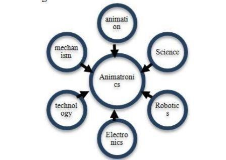
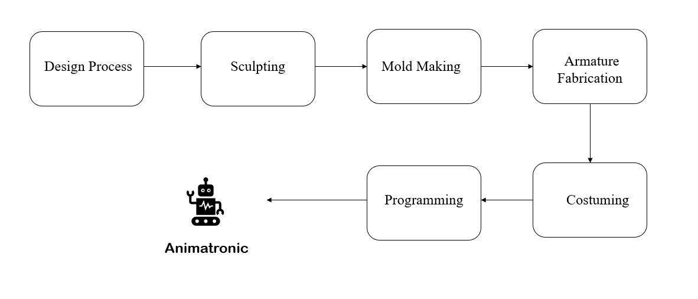
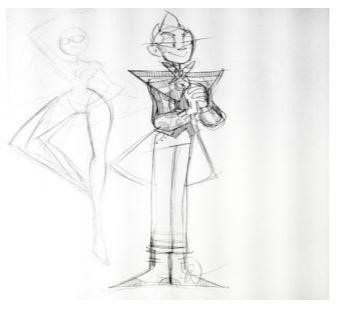
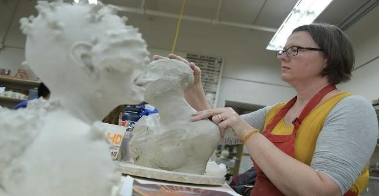
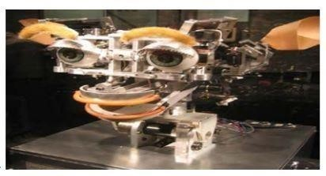
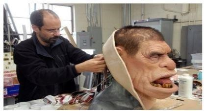
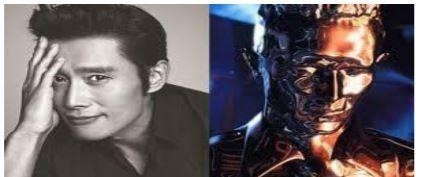

# About ANIMATRONICS   
   
## Development and Designing of Animatronics:

   
- ## Step 1: Design Process   
  
    During the plan procedure, the customer and the organization building up the animatronics choose what the character will be, its appearance complete number of moves, nature of moves, and what every move will be. Spending plans, time lines and check focuses are set up. Numerous years have been spent to guarantee that this basic advance is as basic as would be prudent. When this fundamentally significant stage is hardened, and a course of events is settled upon, the task moves to the chiseling division.  
    
    

  
- ## Step 2: Sculpting  
    The chiseling division is liable for changing over two-dimensional thoughts into three-dimensional structures. This group can work from photographs, fine art, recordings, models, statuettes and comparative similarities. Ordinarily, the customer is approached to support the chiselling before it goes to the trim division.  
    
    

  
- ## Step 3: Mold Making  
  
    The embellishment division takes the structure made by the stone worker and makes the moulds that will at last produce the character skins. Molds can be delicate or hard, single or various pieces, and reusable or non-reusable. To get the stone carver's precise translation, shape making is both a fine art and an expand specialized procedure. The procedure can be very tedious and muddled. It very well may be terrifying to the point that some movement form creators even allude to it as "dark enchantment."   
    After the shape is done and relieved, it is prepared for skin making. Fibre glass shells are all the while being laid up to frame the body and appendage shapes. A portion of these shapes are reusable stock pieces, yet most of shells are uniquely crafted for each character.  
  
- ## Step 4: Armature Fabrication  
  
    In the meantime, different body armatures are being made and are amassed in the welding metal manufacturing regions. Every one of the robot's developments pivot focuses must have a modern evaluated bearing to give activity what's more, long life. Every individual part requires handcraft and manufacture. These craftsmen are consolidating both workmanship and innovation to accomplish reasonably, exact moves.
    

    
      
    As the armature comes to fruition, the actuators, valves, stream controls, and hoses are introduced by the movement office. The experts select those parts cautiously so as to guarantee solidness and long life. As it's collected, each automated move is independently tried and acclimated to get that immaculate development.
  
- ## Step 5: Costuming  
  
    The ensemble, if there is one, is normally custom-made to the character and its developments. Movement fitting can be a troublesome monotonous procedure thinking about the factors. The outfit needs to take into consideration simple access to the character's working components. It should likewise "look" ordinary after development has occurred. The outfit must be intended to give many   a large number of activities without wearing out and without causing the skin areas (i.e. around the necks or wrists) to breakdown also.
    

 
    
- ## Step 6: Programming

    At last, if it is an energized character the electronic wizard moves in to associate the control framework into valve get together in the groundwork for programming. Writing computer programs is the last advance, and for certain liveliness it is the generally fulfilling. Programming should be possible either at the assembling office or then again at the last establishment site. In programming, all the individual moves are facilitated into complex energized activities and subtleties that bring the character to "life".  
     
## Development History   
Animatronics was created by Walt Disney in the early sixties. The main utilization of sound animatronics was for Walt Disney’s charmed tiki room in Disneyland, which opened in June, 1963. Basically, an animatronic manikin is a figure that is enlivened by methods for electromechanical gadgets. Early models were found at the 1964 world reasonable in the New York corridor of presidents and Disney land. Body language and facial movements were coordinated to flawlessness with the recorded discourse animatronics was a mainstream way of diversion that had substantiated itself in the amusement parks what's more, cinematography industry.

An expansion of the designing test is to investigate the adequacy of the undertaking's ability to show human feelings, and to plan the physical components that show practical human facial developments. The target of this exertion was to plan and assemble an animatronic robot ssu-1 (savannah state college 1). The ssu-1 will be constrained by a pre-customized installed microcontroller and will make human like movements for diversion purposes. 

Animatronics gives an extraordinary soul to the non-existent animals to make them alive. A virtual animal was  
certainly, shaped based on science and advancements. This innovation was created by Walt Disney in the year 1960. It is the formation of machines which appears to be so energize. The vivified object is as appeared in the figure above. The execution of this framework can be made by utilizing PC or manual control. Three additional sorts of forces can be given to the enlivened figures, for example, pneumatic, water-driven, or by electronic methods. The predefined controls also, the projects are done physically by a human.  
## SYSTEM IMPLIMENTATION  
- ## Film and television  
    The film business has been the main impetus changing the innovation used to create animatronics. Animatronics are utilized in circumstances where an animal does not exist, the activity is excessively dangerous or exorbitant to utilize genuine on-screen characters or on the other hand creatures or the activity would never be acquired with a living individual or creature. It's the primary bit of leeway over CGI and stop motion is that the re-enacted animal has a physical nearness moving before the camera in continuous.   
    The innovation behind animatronics has become increasingly advance and complex throughout the years, making the manikins much progressively sensible and similar. Animatronics were first presented by Disney in the 1964 film Mary Poppins which included an animatronics winged animal. From that point forward, animatronics has been utilized widely in such films as Jaws, and E.T. the Extra-Terrestrial, which depended intensely on animatronics. Executives, for example, Steven Spielberg and  
    Jim Henson have been pioneers in utilizing animatronics in the film business  
  
- ## Advertising  
    The British promotion crusade for Cadbury Schweppes titled Gorilla included an on-screen character inside a gorilla suit with an animatronic energized face. The was a promoting effort for Comcast Cable’s limit broadband Internet administration. The promotion highlights two animatronic turtles, and it won the gold Effie Award in 2007.  
- ## Toys
    Some examples of animatronic toys include Teddy Ruxpin, Big Mouth Billy Bass, Kota the triceratops, Pleo, Wow Wee Alive Chimpanzee and Furby.  
   
