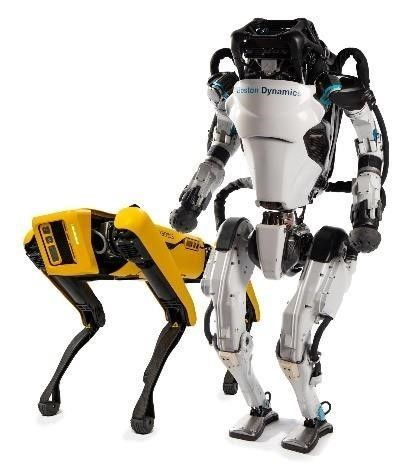
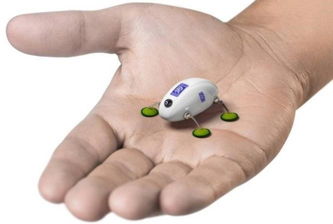
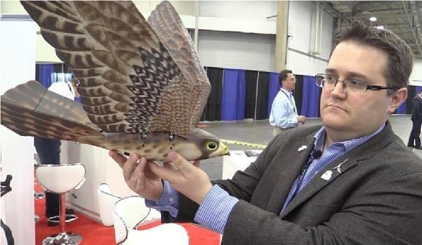

# IMPORTANCE OF THIS TOPIC IN THE CONTEXT OF CURRENT ERA (With Artificial Intelligence)

These Animatronics when worked together Artificial Intelligence can solve numerous problems. The combination of animatronics with man-made brainpower brings about androids, as is generally known, robots that mimic human conduct. We have a strategy equipped for giving the appearance and conduct of living creatures to machines.  
  
  We are 'acculturating' robots. In any case, it's the developments that look genuine as well as, it appears to be genuine gratitude to the manufactured skin they have utilized and cosmetics. The Disney organization is going to utilize animatronics and man-made reasoning to re-enact one of their characters, in actuality: Pascal, one of the characters in the film Tangled. Then again, Dubai is as of now utilizing police robots made by PAL Robotics.

The fusion of animatronics with artificial intelligence results in androids, as is usually known, robots that imitate human behavior. We have a technique capable of providing the appearance and behavior of living beings to machines. We are 'humanizing' robots.  
  
- ## Anki Cozmo
    Cozmo is a skilled little person with his very own brain. He's a genuine robot like you've just found in motion pictures, with a unique character that advances the more you hang out. He'll prod you to play and keep you continually astonished.

    

    

Check the video [here](https://drive.google.com/file/d/1tfNKqc50991zph8qnc3SzLnWS6MJGhAU/view?usp=sharing)

Cozmo's your associate in an insane measure of fun. Cozmo is fun right out of the container, however that is only the start. His capacities and aptitudes grow continually with visit application refreshes, to give better approaches to learn and play.  
  
- ## Boston Dynamics  
    Boston Dynamics is an American building and apply autonomy configuration organization established in 1992 as a side project from the Massachusetts Institute of Technology. Headquartered in Waltham, Massachusetts, Boston Dynamics is a completely claimed backup of the Japanese combination SoftBank Group.  
    
    

    
    
    It is a world head in portable robots, handling the absolute hardest mechanical autonomy challenges. We consolidate the standards of dynamic control and offset with refined mechanical plans, front line gadgets, and cutting-edge programming for superior robots furnished with observation, route, and knowledge. Boston Dynamics has a phenomenal and quickly developing specialized group of architects and researchers who consistently join progressed diagnostic deduction with intense designing and boots-in-the-mud common sense.  
  
- ## Rolls Royce – Bugs & Snake ROBOT
    In organization with Harvard University and the University of Nottingham, Rolls-Royce is attempting to construct 10mm smaller than usual, communitarian robots — called SWARM — that will have the option to give to the human administrator a live video feed of a motor inside by means of little cameras.

    

    Check [video1](https://drive.google.com/file/d/18vpHQk9ySKAKz4s6YhVgNeAf9IaJ-beR/view?usp=sharing) and 
    [video2](https://drive.google.com/file/d/1XIgmMRXJ2LNuHzlIDU_sVOABH8UQrkX9/view?usp=sharing) for working.

    While downsizing these bots to estimate will be a test for the organization and its teammates, it's a test that Harvard University analysts have been working at for a long time at this point, as per an announcement given by Harvard scientist Sebastien de Rivas at the show.   
    
    For SWARM to get to the motors, these little bots will get a ride with FLARE — a couple of endoscopic, snake-like robots that can crawl inside the niches and corners of an enormous bit of apparatus and store SWARM at the investigation point. The organization likewise has plans for FLARE to do inside fix fixes.   
    
    Notwithstanding these yearning plans, Rolls-Royce likewise showed somewhat progressively develop advancements, including a system of periscope-like INSPECT bots, which they plan to for all time introduce inside motors for consistent spot upkeep, just as remote bore blending robots that can be constrained by authority designers to help with muddled support undertakings.   
    
    These sorts of headways in designing could help lead to more cost-productive support of enormous specialties, where beforehand upkeep was driven by inner sensor information and did physically — a procedure that can last as long as five hours, James Kell, Rolls-Royce on-wing innovation master, revealed to The Engineer. With robots like SWARM, Kell told the distribution, the procedure could take as meagre as five minutes.
    
    While the productivity of these automated collaborators can't be denied, the exactness and dependability presently can't seem to be illustrated, and the degree of solace travelers have realizing their airplane was reviewed by an astute swarm of mechanical bugs is still undetermined.  
  
- ## GARUDA Drone
    

    It is an efficient, electric powered, unmanned aerial intelligence gathering system for use in Intelligence, Surveillance, Target tracking & acquisition  

