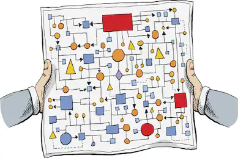
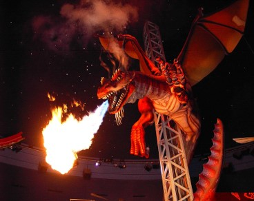
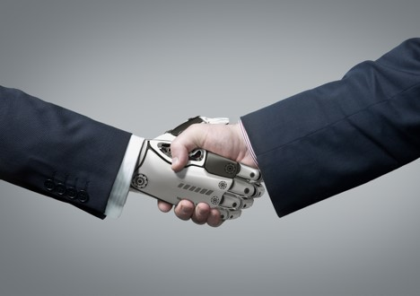

# Merits, Demerits, Applications

## Merits

1. Gives the Real-life experience.  
2. These can be used and controlled according to our wish. It can be used irrespective of time and place.  
3. They remain same for long years so; we can utilize them efficiently than humans.  
4. To make very large and complex real-life animals. V.  	To train soldiers for dangerous operations.  
5. Testing new equipment and their behavior.  

## Demerits

They are hard to assemble or costly to purchase, they may wear out, they require power or packed air, the modest ones need sensible development or outside covers, individuals can harm them in the event that they can draw near and contact them, the mechanical clamours they produce may demolish the impact, most aren't weatherproof.

  
1. It is very costly process.  
2. A lot of skilled persons are required and lot of technical knowledge.  
3. Very Complex process.  
4. Time consuming.  
5. People may find machines scary due to its uncontrolled actions due to damage(sometimes).  
  
## Applications

  
1. Used in Field of Entertainment.  
2. To give special effects in movies.  
3. It can be used to train people for any places without actually going there.  
4. The "Jurassic park" series is known for the realism of its creatures, both the animatronic and digital versions.  
5. Used in Disneyland.  
6. When Integrated with Artificial Intelligence, may used in Health and Military Industries.
## Conclusions and Future Scope   
 Making a decent animatronic figure that can perform continually come what may requires numerous exceptional aptitudes and loads of specialized ability. Before accepting the undertaking of making an animatronic figure, you ought to have a solid hang on how these things are built and be willing to spend a chunk of change on gear and materials.

Animatronics has now evolved as a profession which may require consolidated ability in Mechanical Engineering, Chiseling/Casting, Control Technologies, Electrical/ Electronic, Airbrushing, Radio-Control and so on. In any case, the practical animals that it can make are stunning and is remunerating to its maker.  
  
## Societal Impact

   
There are many applications related to Animatronics. It is used very frequently in Film and Television Industry. Also, as stated when integrated with Artificial Intelligence, this may solve numerous problems.
