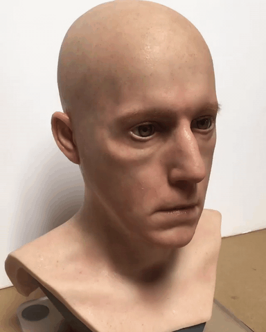
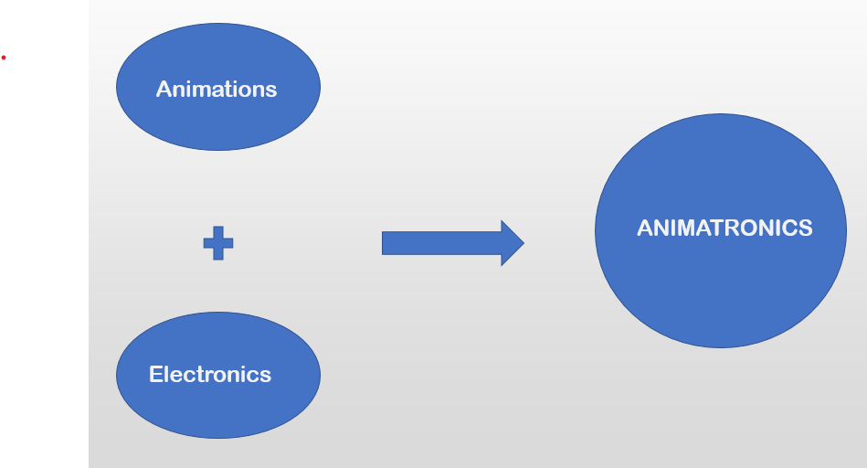

# ANIMATRONICS – How Can Ww Relate It With Artifical Intelligence

 
Animatronics is a cross between animation and electronics. Basically, an animatronic is a mechanized puppet. It may be pre-programmed or remotely controlled. The animations may perform movements, or it may be incredibly versatile. It is the use of cable-pulled devices or actuators to animate a replica of a human or an animal or bring lifelike characteristics to an otherwise inanimate object. Animatronics alludes to the utilization of automated gadgets to copy a human or a creature or bring exact qualities to an in any case lifeless object. Animatronic manifestations incorporate creatures (counting dinosaurs), plants and even legendary animals. A robot designed to be a convincing imitation of a human is more specifically labelled as an android Present-day animatronics have discovered across the board applications in film uncommon impacts and amusement stops and have, since their origin, been fundamentally utilized as a display of delight.

 

The concept was developed for Disney Studios, used in 1954 films. First use Audio – Animatronic was for Walt Disney’s Enchanted Tiki room in Disneyland, 1963. A condensed term initially instituted by Walt Disney as "Audio Animatronics" (used to portray his motorized characters), can really be seen in different structures as far back as Leonardo-Da-Vinci's Automata Lion, (hypothetically worked to introduce lilies to the King of France during one of his Visits). Animatronics gives an uncommon soul to the non-existent animals to make them alive. A virtual animal was certainly, shaped based on science and innovations.   
  
Animatronics is a multi-disciplinary field which incorporates life systems, robots, mechatronics, and puppetry bringing about exact activity. Animatronic figures are regularly fueled by pneumatics, power through pressure, or by electrical implies, and can be executed utilizing both PC control and human control, including tele activity. Movement actuators are regularly used to mimic muscle developments and make reasonable movements in appendages. Figures are secured with body shells and adaptable skins made of hard and delicate plastic materials, and completed with subtleties like hues, hair and plumes and different parts to make the figure increasingly reasonable.  
